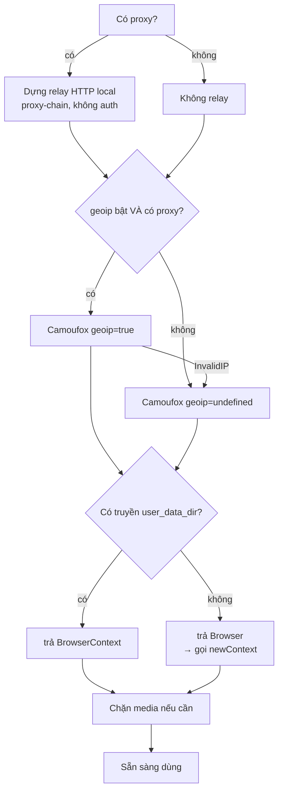

# Đặc tả — quy trình tạo browser Camoufox

Dùng để dựng lại tầng tạo browser ở dự án khác. Mã nguồn tham chiếu:
[`src/browserManager.ts`](../src/browserManager.ts).

Muốn code chạy được ngay thay vì tự viết: xem phần
[Bản code chạy được](#bản-code-chạy-được) ở cuối.

---

## Camoufox là gì

Bản Firefox được vá ở tầng **C++** để spoof fingerprint ngay trong engine
(canvas / WebGL / audio / font / screen / CPU / RAM / WebRTC), điều khiển qua API
Playwright Firefox.

Khác cách tiêm JavaScript sau khi trang đã load ở hai điểm quyết định:

- Không để lại dấu vết "đã patch" cho trang dò.
- `platform` / UA / WebGL / font **tự nhất quán** với nhau theo OS đã chọn.

Đổi lại: engine là Firefox, không phải Chromium. Automation viết theo API
Playwright **Firefox**, và WebGL trả chuỗi kiểu Firefox chứ không phải ANGLE.

**Phụ thuộc:** `camoufox-js`, `playwright-core`, `proxy-chain`.
**Cài binary:** `npx camoufox-js fetch` (~150MB, một lần).

---

## Trình tự



Điểm cần khắc: **geoip chỉ bật khi thật sự có proxy**, và **kiểu trả về đổi theo
`user_data_dir`**. Hai chỗ này là nguồn của phần lớn lỗi.

---

## Bảng tham số launch

| Tham số | Nhận gì | Ý nghĩa | Đổi khi nào |
| --- | --- | --- | --- |
| `user_data_dir` | đường dẫn | Lưu cookie/localStorage giữa các phiên | Bỏ trống = phiên tạm. **Đổi luôn kiểu trả về** — xem bẫy 5 |
| `headless` | `false` \| `'virtual'` \| `true` | `false` = cửa sổ thật, khó bị phát hiện nhất. `'virtual'` = headful trong Xvfb (Docker). `true` = headless thật, nhanh nhất nhưng lộ nhất | Chạy Docker → `'virtual'` |
| `os` | `'windows'`\|`'macos'`\|`'linux'`\|bỏ trống | OS mà fingerprint khai. Bỏ trống = Camoufox tự random mỗi lần | Cần cả đàn giống nhau thì ghim; ngược lại để random |
| `proxy` | `{ server }` | **URL relay local**, không phải proxy thật | Luôn qua relay — xem bẫy 2 |
| `geoip` | `true` \| bỏ trống | Suy timezone + geolocation + locale + WebRTC IP từ IP egress | Tắt khi cần locale cố định — xem bẫy 3 |
| `locale` | `'en-US'`… | Ép locale cứng, **thắng cả geoip** | Khi flow bắt nút theo chữ tiếng Anh — nhưng đọc bẫy 7 trước |
| `block_webrtc` | boolean | Tắt hẳn stack WebRTC | Bật khi sợ rò IP; để tắt thì relay đã ép egress rồi |
| `block_images` | boolean | Không tải ảnh | Bật để tiết kiệm băng thông proxy tính tiền |
| `humanize` | số giây | Trần thời gian animate **một** cú di chuột | Xem bẫy 6 |
| `firefox_user_prefs` | object | Prefs Firefox thô | Quyền geolocation + prefs hiệu năng Windows |
| `config` | object | Config riêng của Camoufox | `mediaDevices:enabled: false` để ẩn camera/mic; `showcursor: false` tắt overlay Windows |
| `screen` | `{minWidth,maxWidth,minHeight,maxHeight}` | Ghim độ phân giải | Ép min=max — xem bẫy 4 |
| `args` | string[] | Tham số dòng lệnh | Hiếm khi cần |

**WebGL cố ý KHÔNG ghim.** Camoufox tự lấy cặp vendor/renderer hợp lý cho OS đã
chọn, có khác nhau giữa các profile. Ghim cứng một cặp làm mọi profile giống hệt
nhau — bản thân điều đó đã là dấu hiệu để gom nhóm.

### Thứ tự ưu tiên của `locale`

```
1. locale ép cứng      → LUÔN thắng, kể cả geoip đang bật
2. geoip bật           → để undefined, nhường geoip tự set khớp IP
3. còn lại             → map country của proxy → locale
```

---

## Bảy cái bẫy

### 1. Phải `import 'camoufox-js'` tĩnh, ngay đầu process

Nạp muộn qua chuỗi `await import()` động thì mouse subsystem của engine chết cả
process:

```
page.mouse.move/click  →  ném "gBrowser ... ownerWindow is undefined"
click rơi xuống synthetic (isTrusted: false)  ←  tín hiệu bot rõ ràng
```

Dự án gốc chốt sau 23 lần probe: static-import đầu process 10/10 OK,
dynamic-import muộn 5/5 hỏng.

Với Electron: đặt dòng đó **trước cả** `import { app } from 'electron'`.

### 2. Proxy phải đi qua relay

SOCKS5 có auth và proxy có user/pass rất khó truyền thẳng cho browser. Dựng relay
HTTP local không auth (`proxy-chain.anonymizeProxy`) forward tới upstream thật:

- phủ đồng nhất http / https / socks5
- credentials **không bao giờ** vào process browser
- đổi upstream không cần restart browser

Relay phải được **đóng** khi đóng browser, nếu không rò listener.

### 3. `geoip` tự tra IP qua proxy và có thể chết

`geoip: true` khiến Camoufox tra IP công khai **qua proxy** (6 endpoint: ipify,
amazonaws…). Proxy chậm hoặc chặn thì fail cả 6 rồi ném `InvalidIP` — giết luôn
cả lần launch.

Phải bắt riêng lỗi đó và **thử lại một lần với `geoip: false`**: thà mất độ khớp
geo còn hơn mất cả profile.

```
err.name === 'InvalidIP'
  || err.message.includes('public proxy IP address from any API endpoint')
```

Và chỉ bật geoip **khi có proxy** — tra geoip lúc không proxy là lấy IP thật của
máy, ngược hẳn mục đích.

### 4. `screen` phải ép min = max

Đặt `minWidth = maxWidth` và `minHeight = maxHeight` buộc fingerprint generator
sinh đúng kích thước đó với **mọi** thuộc tính `screen.*` nhất quán
(`width`/`height`/`availWidth`/`availHeight`).

**Đừng** dùng option `window` để làm việc này: nó chỉ đổi kích thước cửa sổ, còn
`screen.*` vẫn là kích thước màn hình thật (hoặc của Xvfb) — đúng loại lệch mà
trang dò fingerprint bắt được ngay.

### 5. `Camoufox()` trả về HAI kiểu khác nhau

| Truyền `user_data_dir`? | Trả về | Có gì |
| --- | --- | --- |
| **Có** | `BrowserContext` (persistent) | `.pages()` `.route()` |
| **Không** | `Browser` | `.newContext()` |

Ép kiểu mù thành `BrowserContext` rồi gọi `.route()`/`.pages()` ở nhánh không có
`user_data_dir` sẽ ném `is not a function`. Tệ hơn: browser đã spawn mà chưa
đóng nên **process treo vĩnh viễn**, không thoát.

Phải nhận diện rồi chuẩn hoá, và giữ tham chiếu `Browser` để lúc đóng thì đóng đủ
cả hai tầng.

### 6. `humanize` phải đặt trần ngắn

Camoufox có mock con trỏ **native**: engine tự vẽ chuyển động chuột cong,
human-like ở tầng browser — con trỏ di chuyển **thật** trên cửa sổ, khác
`page.mouse.move` của Playwright vốn chỉ phát sự kiện.

Bản mới animate **mỗi** `mouse.move`, nên phải đặt trần ngắn: giữ được đường cong
native nhưng tránh một chuỗi Bezier bị nhân thành nhiều giây. Giá trị dự án gốc
đang dùng: `0.18` trên Windows, `0.06` nơi khác.

### 7. `locale:region` làm hỏng `Intl.DisplayNames`

Đây là lỗi spoof của chính Camoufox, và nó âm thầm: trang vẫn chạy, chỉ có dữ
liệu hiển thị sai.

Camoufox spoof `Intl.DisplayNames` dựa trên `locale:region` trong config. Hễ
config **có** `locale:region` thì:

```
Intl.DisplayNames.of(<mã nước bất kỳ>)  →  luôn trả về CHÍNH nước của region đó
```

Nghĩa là mọi dropdown quốc gia build bằng `Intl.DisplayNames.of(code)` sẽ hiện
**cùng một tên nước lặp lại cho cả danh sách**.

Chỗ dễ hiểu nhầm — `locale:region` sinh ra từ **cả hai** đường:

| Cấu hình | Có region? | `DisplayNames` |
| --- | --- | --- |
| `geoip: true` | có (suy từ IP) | ✗ hỏng |
| `locale: 'en-US'` ép cứng | có (`US`) | ✗ **vẫn hỏng** |
| `geoip: false` + `language: 'real'`, không ép locale | không | ✓ đúng |

Nên **không thể** thay `geoip` bằng ép `locale` để chữa. Muốn `DisplayNames`
đúng thì phải bỏ hẳn region, chấp nhận timezone/geolocation không khớp IP proxy
và UI về mặc định en-US.

Chỉ chạm tới bẫy này khi trang bạn tự động hoá dùng `Intl.DisplayNames` — dropdown
chọn quốc gia là trường hợp điển hình.

---

## Prefs hiệu năng cho Windows

Chỉ áp trên Windows, nơi khác để rỗng:

```
gfx.webrender.software                                  true
fission.autostart                                       false
dom.ipc.processCount                                    1
widget.windows.window_occlusion_tracking.enabled        false
dom.min_background_timeout_value                        1000
```

Lý do quan trọng nhất là dòng thứ tư: Windows đánh dấu cửa sổ bị che là
"occluded" rồi **ngừng render + throttle** nó, làm `page.mouse.move` (Camoufox vẽ
con trỏ thật) đứng hình.

## Quyền geolocation

| Giá trị | Pref cần đặt |
| --- | --- |
| `prompt` | không đặt gì (mặc định Firefox) |
| `allow` | `permissions.default.geo = 1` |
| `disabled` | `geo.enabled = false` |

## Chặn media

Chặn ở tầng route theo `resourceType === 'media'` — bắt cả `<video>`/`<audio>`
lẫn fetch stream, **không** đụng ảnh/SVG. Chặn nhầm SVG là gãy flow vì nhiều nút
bấm là SVG.

---

## Checklist dựng ở dự án mới

- [ ] `import 'camoufox-js'` là dòng import **đầu tiên** của process
- [ ] Có proxy → dựng relay `proxy-chain`, truyền URL relay chứ không phải proxy thật
- [ ] `geoip` chỉ bật khi **có** proxy
- [ ] Bắt `InvalidIP` → thử lại một lần với `geoip: false`
- [ ] Nhận diện `Browser` vs `BrowserContext` theo `user_data_dir`
- [ ] Hàm đóng dọn **đủ ba thứ**: context → browser (nếu có) → relay
- [ ] Mọi lỗi **sau khi** browser đã spawn phải đóng browser trước khi ném
- [ ] Ghim `screen` bằng min=max, không dùng `window`
- [ ] `humanize` có trần ngắn
- [ ] Windows: áp 5 prefs hiệu năng ở trên
- [ ] Trang có dropdown quốc gia → bỏ hẳn `locale:region` (bẫy 7)

Kiểm nhanh xem đã đúng chưa — mở một trang và đọc:

```js
{
  ua: navigator.userAgent,
  platform: navigator.platform,          // đổi theo `os` đã chọn
  screen: `${screen.width}x${screen.height}`,   // đúng giá trị đã ghim
  timezone: Intl.DateTimeFormat().resolvedOptions().timeZone,
}
```

Đổi `os` từ `windows` sang `macos` mà `navigator.platform` đổi từ `Win32` sang
`MacIntel` là tầng spoof đang chạy đúng.

---

## Bản code chạy được

Nếu muốn copy thay vì tự viết, có sẵn một file độc lập gói trọn quy trình trên —
đã chạy thật, kiểm cả hai nhánh `Browser` và `BrowserContext`:

```
/Users/hoangjump/Downloads/mktproxy-handoff/camoufox-standalone.ts
```

Cần `npm i camoufox-js playwright-core proxy-chain` và `npx camoufox-js fetch`.
