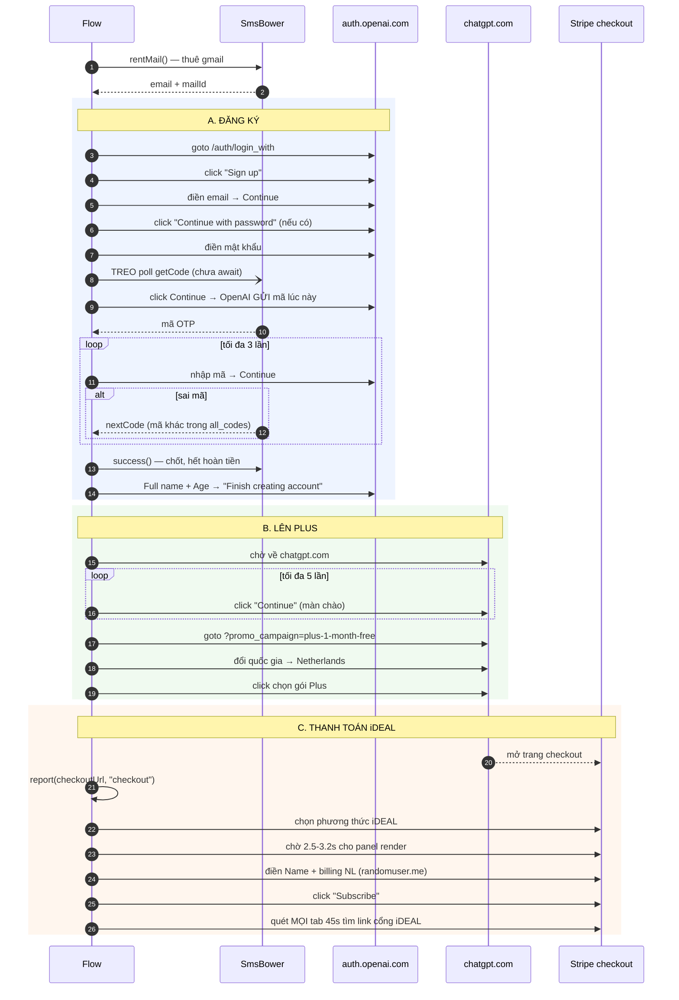

# Đặc tả trình tự — flow `chatgpt-signup`

Đăng ký tài khoản ChatGPT bằng gmail thuê SmsBower, rồi nâng lên Plus qua iDEAL
(Hà Lan). Mã nguồn: [`src/flows/chatgpt-signup.ts`](../src/flows/chatgpt-signup.ts).

Tài liệu này mô tả **thứ đang chạy**, không phải thứ dự định làm. Sửa flow thì
sửa luôn file này.

**Bản đặc tả bằng code** (để bàn giao cho người implement lại):
[`src/flows/chatgpt-signup.contract.ts`](../src/flows/chatgpt-signup.contract.ts) —
dữ liệu có kiểu, `import` thẳng selector từ flow đang chạy, kèm test chặn lệch
([`chatgpt-signup.contract.test.ts`](../src/flows/chatgpt-signup.contract.test.ts)).

---

## Điều kiện tiên quyết

| Cần gì | Ở đâu | Không có thì |
| --- | --- | --- |
| API key SmsBower | `Cài đặt → Thuê số nhận OTP` | Không thuê được gmail, flow chết ở bước 0 |
| Mã service SmsBower | `Chạy tự động → Mã service` | Mặc định `dr` (OpenAI/ChatGPT) |
| Proxy **sticky** vùng EU | Kho proxy, gán cho project | Thanh toán bị Stripe từ chối (xem [Ba mấu chốt](#ba-mấu-chốt-dễ-sai)) |

Flow tự đặt anti-detect riêng, **khác mọi flow khác**
([routes/projects.ts:417](../src/server/routes/projects.ts)):

```ts
{ ...defaultAntiDetect(), geoip: false, language: 'real' }
```

Mật khẩu dùng chung cho mọi tài khoản: hằng `PASSWORD` trong flow.

---

## Trình tự



---

## Từng bước

### A. Đăng ký

| # | Việc | Bắt bằng | Hỏng thì |
| --- | --- | --- | --- |
| 0 | Thuê gmail SmsBower | `rentMail()` | Chết ngay, chưa tốn gì |
| 1 | Vào `chatgpt.com/auth/login_with` | chờ URL `auth.openai.com` | Chờ 30s rồi đi tiếp |
| 2 | "Sign up" | `a[href="/create-account"]` | Bỏ qua nếu không thấy |
| 3 | Điền email → Continue | `SEL_EMAIL` (5 selector) | **Ném lỗi** + ảnh `chatgpt-no-email` |
| 4 | "Continue with password" | `a[href="/create-account/password"]` | Bỏ qua (màn này không phải lúc nào cũng có) |
| 5–7 | Mật khẩu → **treo poll** → Continue → mã | `SEL_PASSWORD`, `SEL_CODE` | **Ném lỗi** + ảnh `chatgpt-no-pass` / `chatgpt-no-code` |
| 7b | Nhập mã, tối đa **3 lần** | `BTN_VALIDATE` | Hết 3 lần → ảnh `chatgpt-code-stuck` |
| — | `mailbox.success()` | — | Từ đây **không hoàn tiền** số nữa |
| 8 | Full name + Age (20–45, tên Việt ngẫu nhiên) | `SEL_NAME`, `SEL_AGE` | Bỏ qua nếu không thấy |
| 9 | "Finish creating account" | `button[type=submit]` chứa "Finish" | Bỏ qua |

### B. Lên Plus

| # | Việc | Ghi chú |
| --- | --- | --- |
| 10 | Bấm "Continue" màn chào, lặp tối đa 5 lần | Không bấm hết thì bước 11 bị che |
| 11 | `?promo_campaign=plus-1-month-free#pricing` | `#pricing` **bắt buộc** để bung bảng giá |
| 12 | Đổi quốc gia → Netherlands | Cuộn dropdown, thử lại 2 lần; hỏng → ảnh `chatgpt-country-fail` |
| 13 | Chọn gói Plus | `[data-testid="select-plan-button-plus-upgrade"]` — dùng chung cho "Upgrade to Plus" lẫn "Claim free offer" |

### C. Thanh toán

Toàn bộ phần C **bọc try/catch riêng** — hỏng ở đây **không huỷ** kết quả tạo tài
khoản, chỉ báo `signup-ok-pay-failed`.

| # | Việc | Ghi chú |
| --- | --- | --- |
| 14 | Chờ tab checkout | `chatgpt.com/checkout` hoặc `checkout.stripe.com`, 45s |
| 14b | Chọn iDEAL | Ưu tiên phần tử **bấm được** (`radio`/`tab`/`button`/`label`), text chung chỉ là fallback |
| 15–18 | Billing Hà Lan từ `randomuser.me` | Ô **Name** cần ≥ 3 ký tự, render **trễ** → tìm theo nhãn, chờ 12s |
| 18b | "Subscribe" | `button[aria-label="Subscribe"]` |
| 19 | Quét mọi tab 45s tìm link cổng iDEAL | Đồng thời dò chữ "declined" trên **mọi frame** |

---

## Kết quả cuối — `report({ status })`

| Status | Nghĩa | Làm gì |
| --- | --- | --- |
| `checkout` | Đã tới trang thanh toán | (trạng thái trung gian) |
| `ideal-link` | ✅ Bắt được link cổng iDEAL | Xong, link nằm ở `checkoutUrl` |
| `subscribe-clicked` | Bấm Subscribe nhưng 45s không có link | Có thể **đúng**: "Due today €0.00" thì không redirect |
| `payment-declined` | Stripe **chặn rủi ro** | Không phải lỗi selector — xem mấu chốt 3 |
| `signup-ok-pay-failed` | Tài khoản tạo xong, phần trả tiền lỗi | Tài khoản vẫn dùng được |

---

## Ba mấu chốt dễ sai

### 1. Phải TREO SmsBower *trước* khi bấm Continue

OpenAI gửi mã xác minh **đúng lúc** bấm Continue sau mật khẩu. Flow bắt đầu poll
`getCode` **trước** cú click, chưa `await`:

```ts
const codePromise = mailbox.waitCode({ intervalMs: 3_000, tries: 60 });  // treo
await clickLoc(contPass, log, 'Continue (sau mật khẩu)');                // rồi mới bấm
```

Poll **sau** khi bấm sẽ vớ phải mã cũ còn sót, dùng sai → activation `dr` khoá
cứng (`available_to_get_next_code=false`) và **hỏng cả lượt thuê**.

### 2. `geoip: false` + `language: 'real'` là bắt buộc cho flow này

Đây là **lỗi spoof của chính Camoufox**, không phải lỗi selector.

Camoufox spoof `Intl.DisplayNames` dựa trên `locale:region` trong config. Hễ
config **có** `locale:region` thì spoof hỏng theo kiểu rất đặc trưng:

```
Intl.DisplayNames.of(<mã nước bất kỳ>)  →  luôn trả về CHÍNH nước của region đó
```

Dropdown quốc gia của ChatGPT build bằng `Intl.DisplayNames.of(code)`, nên cả
danh sách hiện **cùng một tên nước** lặp đi lặp lại → `selectCountry` chọn sai.

⚠️ Chỗ dễ hiểu nhầm: `locale:region` sinh ra từ **cả hai** đường —

| Cấu hình | Có `locale:region`? | DisplayNames |
| --- | --- | --- |
| `geoip: true` | có (suy từ IP) | ✗ hỏng |
| `locale: 'en-US'` ép cứng | có (`US`) | ✗ **vẫn hỏng** |
| `geoip: false` + `language: 'real'`, không ép locale | không | ✓ đúng |

Nên **không thể** thay `geoip` bằng ép `locale` để chữa. Phải bỏ hẳn region.

Đánh đổi có ý thức: timezone/geolocation **không còn khớp** IP proxy, UI về mặc
định của Camoufox (en-US). Các flow khác giữ `geoip` như cũ.

### 3. Bị "declined" là chống gian lận, không phải lỗi code

Sửa selector không cứu được. Hai nguyên nhân thật:

- **IP xoay giữa chừng.** Proxy xoay 1 phút/lần mà flow chạy ~3 phút → tạo tài
  khoản một IP, trả tiền một IP khác. Stripe coi là gian lận. **Phải dùng proxy
  sticky suốt phiên.**
- **Lệch vùng.** IP Việt Nam nhưng iDEAL + billing Hà Lan. Cần IP đúng vùng NL/EU.

IP cũng "cháy" sau khoảng 4–5 lần dùng.

---

## Tiền: vòng đời thuê số

```
rentMail()  ──►  đang thuê  ──┬─► success()  →  TÍNH TIỀN, không hoàn
                              └─► cancel()   →  HOÀN TIỀN
```

Cờ `finalized` quyết định: lỗi **trước** khi `success()` thì `catch` gọi
`cancel()` để đòi lại tiền. Sau đó thì không.

`nextCode()` đọc lại từ `all_codes` của cùng lượt thuê — OpenAI gửi 2–3 mã, đọc
lại được, **không** tốn thêm request.

---

## Ảnh chụp khi lỗi

Flow tự chụp màn hình vào `<STORE_ROOT>/shots/` (mặc định `profiles-store/shots/`)
ở mỗi mốc và mỗi lỗi:

`chatgpt-01-login` · `chatgpt-02-after-code` · `chatgpt-03-account-done` ·
`chatgpt-04-plan` · `chatgpt-05-checkout` · `chatgpt-06-billing` ·
`chatgpt-07-ideal` | `-declined` | `-after-subscribe`

Lỗi: `chatgpt-no-email` · `chatgpt-no-pass` · `chatgpt-no-code` ·
`chatgpt-code-stuck` · `chatgpt-country-fail` · `chatgpt-captcha` ·
`chatgpt-phone` · `chatgpt-pay-error` · `chatgpt-error`

---

## Ngoài phạm vi

Flow **không tự giải** hai thứ sau, chỉ ghi log cảnh báo + chụp ảnh:

- **Captcha** (Turnstile / Arkose) — hàm `warnBlockers()` phát hiện và báo.
- **Xác minh số điện thoại** — API mail SmsBower không cấp số thoại được.

Gặp hai thứ này thì lượt đó coi như hỏng; đổi IP sạch rồi chạy lại.
